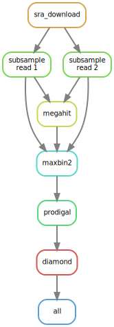

# Simple Metagenomics
A BIOF501 term project for inferring protein annotations of metagenome-assembled genomes (MAG) from metagenomic reads hosted on [NCBI's sequence read archive (SRA)](https://www.ncbi.nlm.nih.gov/sra)

-------------------------

## For the Impatient
```
pip install simple-metagenomics
smg setup -c singularity -r ./ref
smg run -r ./ref -i SRR22508334 -o ./out
```

## Background and Rationale

Throughout the various biomes of Earth, complex consortia of microorganisms thrive and cycle nutrients at scales ranging from symbiosis to global biogeochemical cycles. The study of these consortia has contributed to advances in many fields, including health in the context of host microbiomes [[n](#references)], renewable energy in the context of biofuels [[n](#references)], and ecology in the context of distributed metabolisms [[n](#references)]. Since only a select few microbes have been successfully cultured in laboratory conditions, the typical approach is to interrogate the microbial gene content of a sample directly using metagenomics.

The aim of this pipeline is to provide a simple method of converting raw metagenomic sequencing reads into meaningful annotations.

## Usage

### **Manual Dependencies**

- Linux OS/amd64
- Python, version>=3.4 (so that you also have pip)
- Singularity

### **Installation**
We recommend that you use a virtual environment

via conda...
```
    conda create --no-default-packages --name smg python
    conda activate smg
```

**or** via venv
```
    pip install venv
    python -m venv ./smg
    source ./smg/bin/activate

```

In the environment, install simple metagenomics
```
    pip install simple-metagenomics
```

Select a folder for additional reference resources (we used `./ref`).
```
    smg setup -r ./ref
```

### **Getting Annotations**

```
    smg run -r ./ref -i 
```


<table>
 <tr>
    <td>
        
    </td>
    <td valign="top">
        <p>
            asdf
        </p>
        <p>2</p>
        <p>3</p>
        <p>4</p>
    </td>
 </tr>
</table>


## References
todo: use Zotero

[1] [The Host Microbiome Regulates and Maintains Human Health: A Primer and Perspective for Non-Microbiologists](https://doi.org/10.1158/0008-5472.CAN-16-2929)

[2] [Cyanobacteria as a platform for biofuel production](https://www.frontiersin.org/articles/10.3389/fbioe.2013.00007/full)

[3] [mealybugs](https://www.ncbi.nlm.nih.gov/pmc/articles/PMC3169327/)

[x] [Scaling laws predict global microbial diversity](https://doi.org/10.1073/pnas.1521291113)

https://www.ncbi.nlm.nih.gov/sra?term=(%22metagenome%22%5BOrganism%5D)%20AND%20%22wgs%22%5BStrategy%5D

SRR19586134
